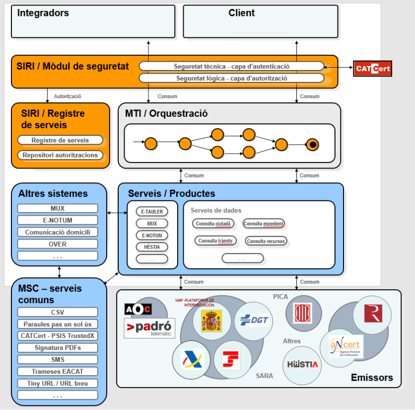
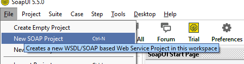
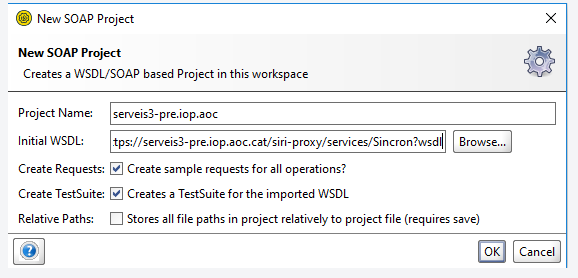
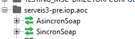
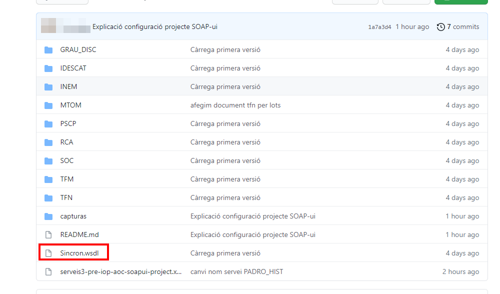
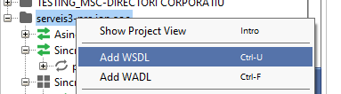
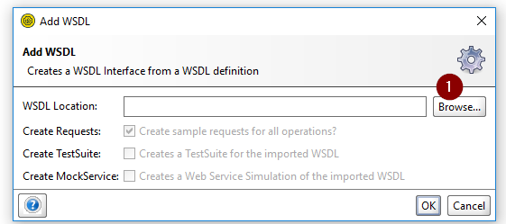
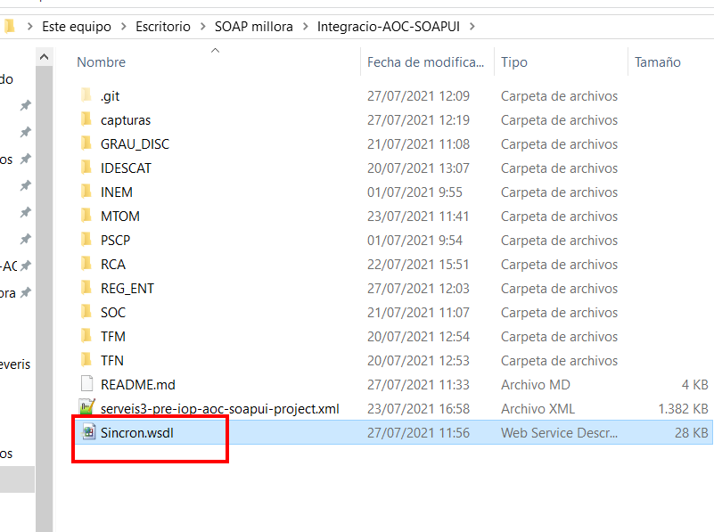
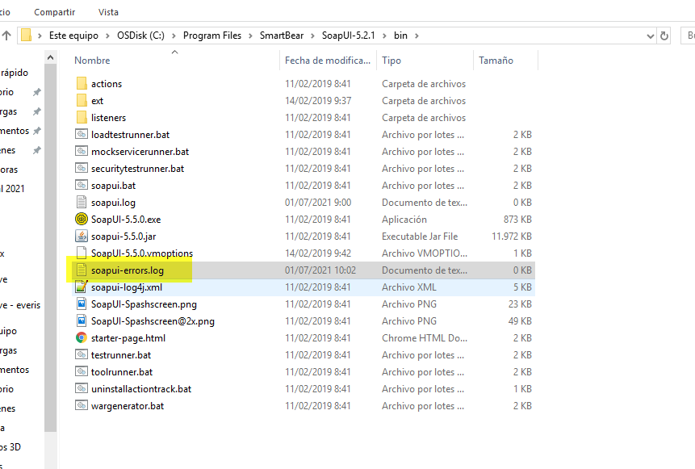

# EN FASE CONSTRUCCIÓ

# Integracio-AOC-SOAPUI
Projecte SOAPUI amb peticions d'exemple de les diferents modalitats de consum dels serveis web del consorci AOC.

En el nostre cas, per tal de poder oferir un millor servei de suport, explicarem com configurar el nostre SOAP-ui amb els WSDL i configurant un certificat per tal de poder reproduir un circuit sencer de petició AOC:

1 Generem XML que apunta a l'endpoint del servei que volem consumir (APP, IOP, NT)

2 Amb la petició signada WSS o per canal SSL enviem l'XML que pasarà per les pases:

    2.1 Validació SIRI (capa seguretat per validar que l'autenticació sigui correcte)

    2.2 Una vegada validat, es pasa la petició a la MTI per orquestrar a quin servei s'ha d'enviar

    2.3 S'envia al servei

    2.4 S'envia cap a l'emissor (és fa el consum)

# Preparació projecte SOAP

## Importar el WSDL

Importem WSDL de PRE per IOP: **https://serveis3-pre.iop.aoc.cat/siri-proxy/services/Sincron?wsdl** (pot ser APP, NT, entorn de PRO, DEV...) → Els podem trobar en el [DI de la PCI][URL1]

[URL1]: https://github.com/ConsorciAOC/PCI/blob/main/Missatgeria/README.md

Amb aquestes dues accions hem generat el projecte:

---
Tenim un WSDL adaptat amb els .xsd dels diferents serveis per fer la validació dels XML tant per missatgeria específica com per missatgeria genèrica

En aquest cas, per carregar el wsdl, ens el tindrem que descarregar de la web i carregar el SOAP-ui

---
## Carregar WSDL adaptat

Ens tindrem que descarregar el wsdl que tenim en aquesta web i les carpetes amb els .xsd en local

En el nostre projecte, clickem al botó dret del ratolí i seleccionem "ADD WSDL"

Carreguem el WSDL

---

**Com revisar els logs en cas d'error de càrrega del WSDL**

En cas d'error al carregar el WSDL, els logs els podrem trobar en:

_''C:\Program Files\SmartBear\SoapUI-5.2.1\bin_

---

## Configuració certificat per fer els consums

---
***A nivell de PCI hi ha dues vies per autoritzar els consums***

- Presentant un certificat de client autoritzat pel canal [SSL][URL2].

[URL2]: https://www.soapui.org/docs/soap-mocking/securing-mockservices-with-ssl/

- Adjuntant les capçaleres [WSS][URL3] amb la signatura corresponent de la petició amb el certificat autoritzat.

[URL3]: https://www.soapui.org/docs/security-testing/ws-security-settings/

---

### Configuració per canal SSL

~~~~
La configuració per SSL es recomana per MTOM, no obstant, tambè es factible per serveis no MTOM
~~~~

En l'apartat de "Preferences anirem a "SSL Settings" i configurem el certificat. En aquest cas és el SEGELL_AOC.jks 

El certificat de proves (Serveis_Administracio_Electronica.cer) el podem trobar en la ruta de xarxa : ***\\\192.168.166.135\tecnologia\SUPORT_TECNIC\CERTIFICATS\SEGELL\Segell Administracio Electronica_Gener_2019***

### Configuració per WSS

En el projecte que hem generat, donem doble click en la carpeta i anem a "WS-Security Configurations"

AFegim el certificat, en l'apartat de "keystore"

Afegimamb el "+" el certificat en "outgoing WS - Security Configurations

Premem el "+" i afegim el "Timestamp" on el TTL ha de ser 300

Premem el "+" i afegim el certificat de proves i en keysotre seleccionem el que hem configurat.

---
***la clau és marcar "use single cert for signing" d'aquesta manera el valor ValueType="http://docs.oasis-open.org/wss/2004/01/oasis-200401-wss-x509-token-profile-1.0#X509v3".***

---

### Afegim la capçelera de segurat per WSS

En la petició XML afegim capçelera de seguretat, abem a "Auth (Basic) i seleccionem el certificat que hem configurat per WSS.

# Consums per MTOM

Per consumir per MTOM, no ha de tindre Capçalera de seguretat. Hem fet la configuració tal qual indica la web de [SOAP-Ui][URL4]

[URL4]: https://www.soapui.org/docs/soap-and-wsdl/attachments/

---
*   ***Enable MTOM***  → True
*   ***Disable multiparts*** → True
---

Els adjunts, els fiquem dintre del tag Ficheros i en "Contenido" (1) (tal com indica la imatge i en el "+" afegim el document a adjuntar (2).

