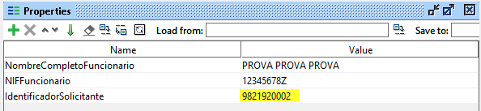
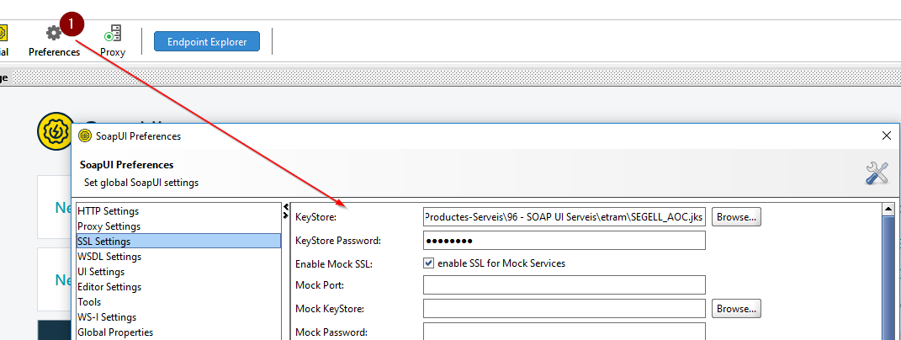
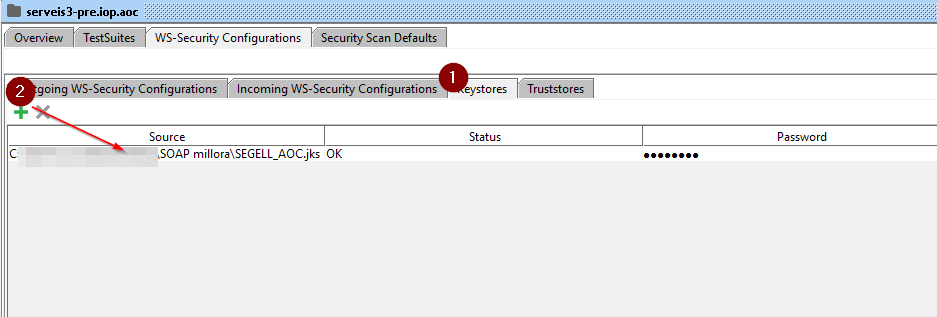
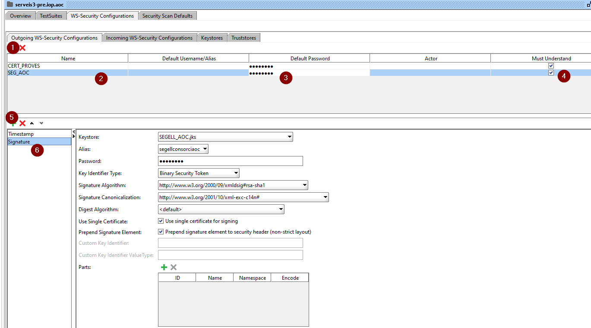
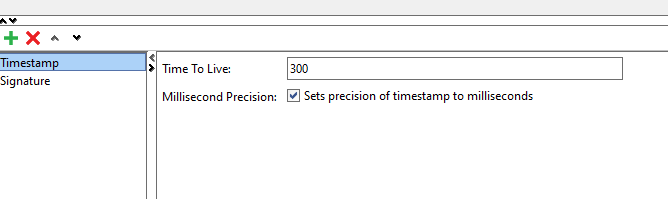
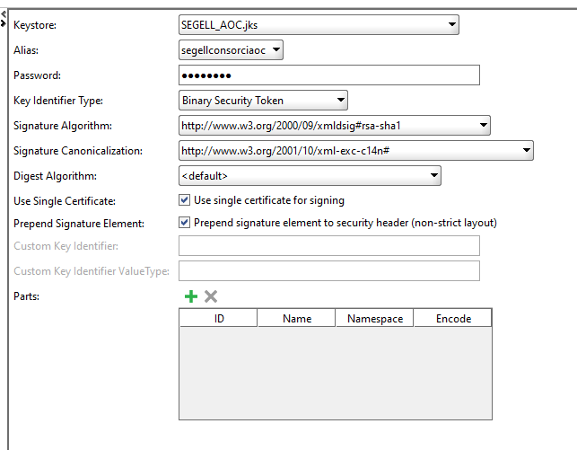
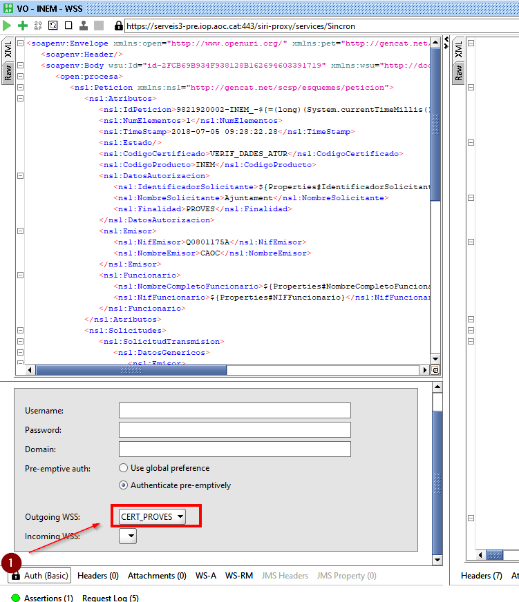
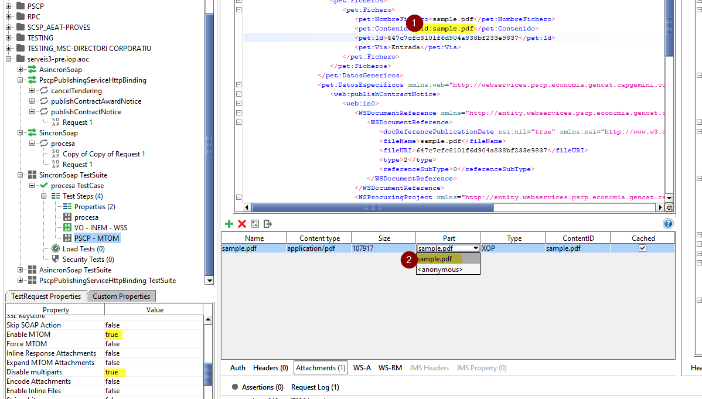

# Integració-AOC-SOAPUI

En aquest repositori oferim tres Projectes `SOAPUI` amb peticions en format XML d'exemple per als consums dels diferents serveis del Consorci AOC; per tal que els integradors puguin fer les proves i validacions oportunes dels consums i de la missatgeria PCI i de l'específica de cadascún d'aquests serveis.

---
```diff
- Important, has d'estar autoritzat per consumir el servei, modalitat i finalitat en la PCI.
```
---

En cas de no estar autoritzat, heu de seguir les passes indicades a la [FAQ][URL1] per tal de que us poguem autoritzar el consum dels serveis.

[URL1]: https://www.aoc.cat/knowledge-base/quines-dades-necessita-consorci-aoc-me-integrar-servei/

Per qualsevol altre dubte o aclariment, podeu obrir tiquet a través del següent [formulari][URLFORM].

[URLFORM]: https://www.aoc.cat/portal-suport/peticio-integradors/


Per cadascún dels diferents entorns de PCI (APP/IOP/NT) oferim un projecte `SOAPUI` amb exemples de consum dels serveis d'aquell entorn. 

A continuació és decriuen les passes per tal de poder usar els projectes.

## Accions a realitzar

1. Descarregueu el `zip` amb l'última versió que conté [els 3 projectes][linkrelease]
2. Importeu el projecte desitjat a través de `SOAPUI` (File > Import Project o `CTRL+I`)
3. Configuració de les [claus per a realitzar els consums][link1]

[link1]: https://github.com/ConsorciAOC/Integracio-AOC-SOAPUI#configuraci%C3%B3-de-claus-per-fer-els-consums
[linkrelease]: https://github.com/ConsorciAOC/Integracio-AOC-SOAPUI/releases


El projecte disposa d'un fitxer de propertes que haurem d'omplir amb les dades de l'ens que s'està integrant:



```diff
- Important, si no es modifica el properties, obtindreu un error.
```

## Configuració de claus per fer els consums

***A nivell de PCI hi ha dues vies per autoritzar els consums***

- Presentant un certificat de client autoritzat pel canal [SSL][URL2].

[URL2]: https://www.soapui.org/docs/soap-mocking/securing-mockservices-with-ssl/

- Mitjançant capçaleres [`WSS`][URL3] amb la signatura corresponent de la petició amb el certificat autoritzat.

[URL3]: https://www.soapui.org/docs/security-testing/ws-security-settings/

### Configuració per canal SSL

La configuració per SSL es recomana per peticions amb adjunts `MTOM`, no obstant, es pot fer servir aquest mecanisme per a tots els consums.

En l'apartat de `Preferences` anirem a `SSL Settings` i configurem el magatzem de claus.



D'aquesta manera totes les peticions contra un endpoint `https` presentaran la clau configurada com a autenticació del client.

### Configuració per WSS

En el projecte que hem importat, fem doble click a la carpeta i anem a la pestanya `WS-Security Configurations`:

Afegim el certificat (haureu de generar un .JKS amb el certificat que utilitzareu per signar les peticions), en l'apartat de `keystore`



Afegim amb el `+` el certificat en `outgoing WS - Security Configurations`



Premem el `+` i afegim el `Timestamp` on el TTL ha de ser 300 segons



Premem el `+` i afegim el certificat de proves i en keystore seleccionem el que hem configurat.



---

***És important seleccionar `use single cert for signing` d'aquesta manera el valor `ValueType="http://docs.oasis-open.org/wss/2004/01/oasis-200401-wss-x509-token-profile-1.0#X509v3"` necessari perquè les capçaleres `WSS` siguin tractades correctament***

---

### Afegim la capçelera de segurat per WSS

A la petició XML afegim capçelera de seguretat, anem a `Auth (Basic)` i seleccionem el certificat que hem configurat per `WSS`.



# Consums per MTOM

Per a realitzar peticions amb adjunts en format `MTOM`, sempre hem d'utilitzar la autorització per `SSL`. A nivell de `SOAPUI` la configuració de `MTOM` s'ha fet seguint la documentació oficial [SOAP-Ui][URL4]

[URL4]: https://www.soapui.org/docs/soap-and-wsdl/attachments/

---
*   ***Enable MTOM***  → True
*   ***Disable multiparts*** → True
---

Els adjunts, els afegim dins del tag `<Ficheros>` i a `<Contenido>` (1) (tal com indica la imatge i amb el `+` afegim el document a adjuntar (2) ).


